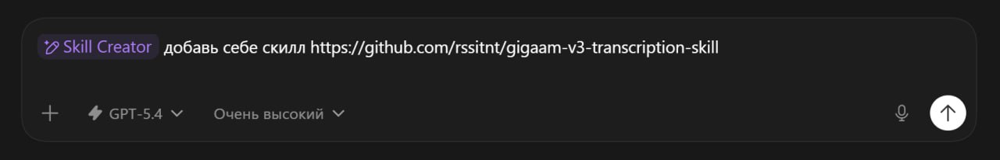

# gigaam-v3-transcription-skill

<p align="center">
  
</p>

Публичный standalone-проект AgentSkill для локальной транскрибации через **GigaAM-v3**.

> Если ты агент и тебе дали ссылку на этот репозиторий со словами **«скачай skill»**, сначала открой:
>
> `C:\projects\automations\gigaam-v3-transcription-skill\INSTALL.md`

## Что это за репозиторий

Этот репозиторий нужен для того, чтобы другой человек мог:

1. скачать репозиторий;
2. поднять локальный runtime GigaAM-v3;
3. упаковать skill;
4. транскрибировать локальный медиафайл;
5. получить артефакты транскрибации на диске.

## Что делает skill

Skill предназначен для:
- транскрибации аудио;
- транскрибации голосовых сообщений;
- транскрибации звука из видео;
- fallback-транскрибации, когда публичные captions не отдаются.

Ожидаемые выходные артефакты:
- `transcript.txt`
- `transcript.json`
- `final_summary.json`

## Структура репозитория

- `AGENT.md` — рабочая инструкция для coding-агентов, которые улучшают этот проект
- `docs/public-skill-spec.md` — продуктовая спецификация публичного skill
- `docs/runtime-contract.md` — контракт runtime/config
- `skill/` — исходники самого AgentSkill
- `skill/SKILL.md` — описание skill
- `skill/scripts/bootstrap_gigaam_runtime.py` — bootstrap-скрипт runtime
- `skill/scripts/gigaam_skill_runtime.py` — standalone runtime adapter
- `skill/scripts/run_gigaam_transcription.py` — wrapper, который вызывает skill
- `skill/config/config.env.example` — пример конфига
- `skill/references/setup.md` — setup reference, на который ссылается skill
- `artifacts/skill.skill` — упакованный артефакт skill

## Быстрый старт

### 1. Основной режим: agent-first установка по ссылке

Если пользователь просто даёт агенту ссылку на репозиторий и говорит «скачай skill», базовый путь теперь такой.

Самый короткий источник истины для агента:
- `C:\projects\automations\gigaam-v3-transcription-skill\INSTALL.md`

#### Windows

```powershell
powershell -ExecutionPolicy Bypass -File .\scripts\install-from-url.ps1 -RepoUrl https://github.com/rssitnt/gigaam-v3-transcription-skill.git
```

#### Linux

```bash
bash ./scripts/install-from-url.sh https://github.com/rssitnt/gigaam-v3-transcription-skill.git
```

После этого агент должен проверить:
- `C:\projects\automations\gigaam-v3-transcription-skill\artifacts\install-report.json`

Подробный контракт для агентов:
- `C:\projects\automations\gigaam-v3-transcription-skill\install-manifest.json`
- `C:\projects\automations\gigaam-v3-transcription-skill\docs\agent-install-contract.md`

### 2. Ручной / fallback режим

### 2.1 Клонировать репозиторий

```bash
git clone <repo-url>
cd gigaam-v3-transcription-skill
```

### 2.2 Самая простая установка

#### Windows

```powershell
powershell -ExecutionPolicy Bypass -File .\scripts\install.ps1
```

#### Linux

```bash
bash ./scripts/install.sh
```

Что делает installer-слой:
- проверяет Python;
- если Python отсутствует, пытается поставить его автоматически;
- после этого запускает bootstrap skill runtime;
- bootstrap уже сам поднимает GigaAM runtime и разбирается с `ffmpeg`.

### 3. Поднять runtime напрямую

Если не нужен верхний installer-слой, можно запускать bootstrap напрямую:

```bash
python3 skill/scripts/bootstrap_gigaam_runtime.py
```

Дополнительные режимы для `ffmpeg`:

```bash
python3 skill/scripts/bootstrap_gigaam_runtime.py --ffmpeg-mode auto
python3 skill/scripts/bootstrap_gigaam_runtime.py --ffmpeg-mode system
python3 skill/scripts/bootstrap_gigaam_runtime.py --ffmpeg-mode download
```

Что должно появиться после bootstrap:
- локальный клон GigaAM в `.runtime/GigaAM`
- локальный venv в `.runtime/gigaam-venv`
- локальный конфиг в `skill/config/local.env`

Подробности по installer-слою:
- `C:\projects\automations\gigaam-v3-transcription-skill\docs\installer-flow.md`

### 4. Сделать smoke-transcription

```bash
python3 skill/scripts/run_gigaam_transcription.py \
  --input /absolute/path/to/local-media-file \
  --env-file skill/config/local.env
```

### 5. Упаковать skill

На машине, где доступен OpenClaw skill tooling:

```bash
python3 /home/qwert/.npm-global/lib/node_modules/openclaw/skills/skill-creator/scripts/package_skill.py \
  /mnt/c/projects/automations/gigaam-v3-transcription-skill/skill \
  /mnt/c/projects/automations/gigaam-v3-transcription-skill/artifacts
```

Итоговый упакованный skill:
- `C:\projects\automations\gigaam-v3-transcription-skill\artifacts\skill.skill`

## Текущий честный статус

В этом репозитории уже подтверждено:
- skill валидируется и пакуется;
- bootstrap создаёт project-local runtime;
- cold-start транскрибация через этот runtime работает;
- артефакты транскрибации пишутся корректно;
- появился agent-first install contract: install manifest + verify/report path + install-from-url entrypoints.

Что ещё стоит улучшить:
- заменить жёсткий пример packaging-команды на repo-local helper;
- добавить автоматические тесты для bootstrap/config loading;
- отполировать release workflow для пользователей вне текущей машины.

## Важные ограничения

- первый bootstrap скачивает зависимости и может занимать время;
- модель и runtime поднимаются локально, это не zero-dependency сценарий;
- проект уже близок к публичному релизу, но его ещё можно улучшать по UX и тестовому покрытию.

## Основные пути в репозитории

- публичный skill: `C:\projects\automations\gigaam-v3-transcription-skill\skill`
- упакованный артефакт: `C:\projects\automations\gigaam-v3-transcription-skill\artifacts\skill.skill`
- bootstrap reference: `C:\projects\automations\gigaam-v3-transcription-skill\skill\references\setup.md`
